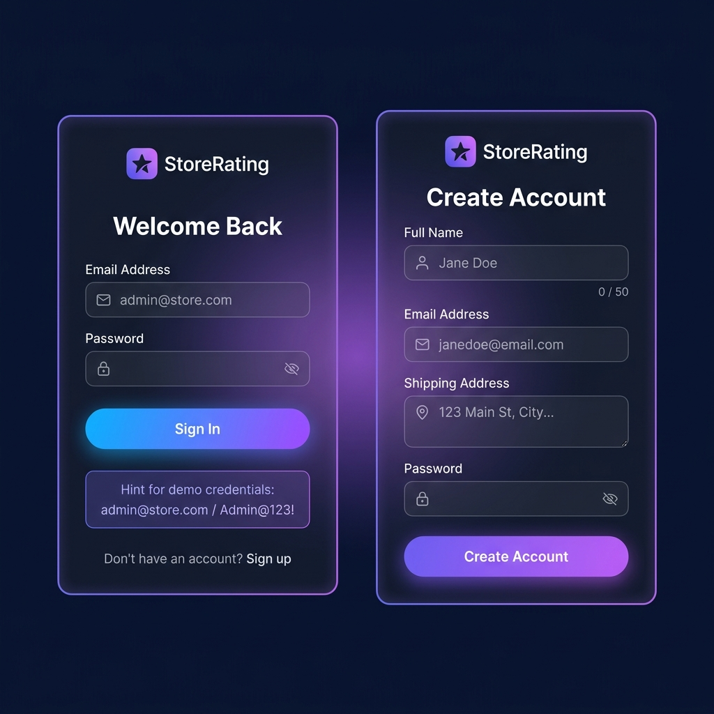
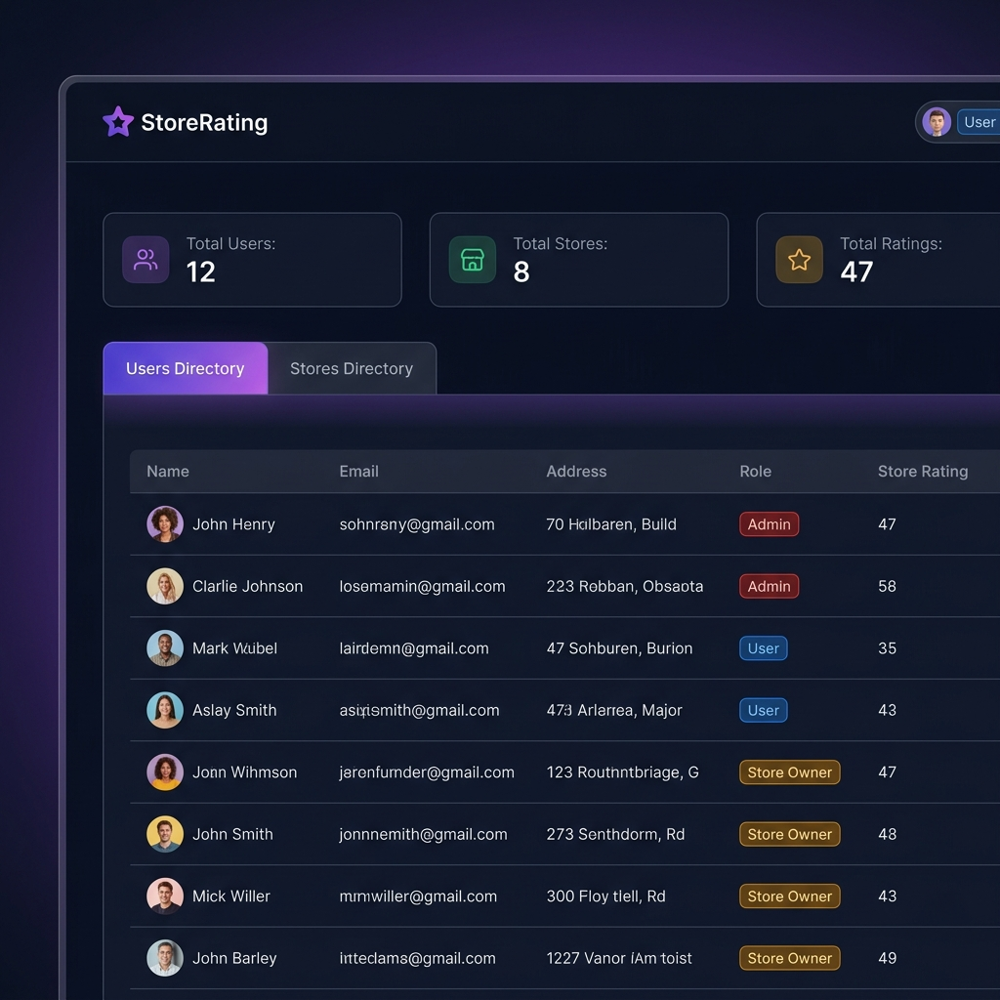
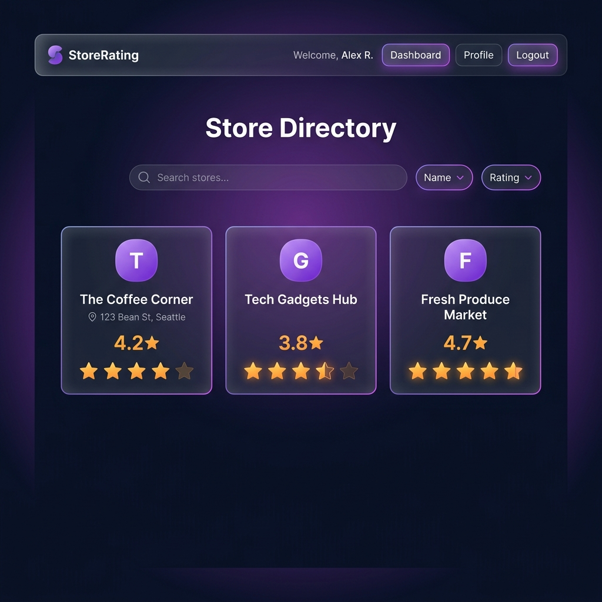
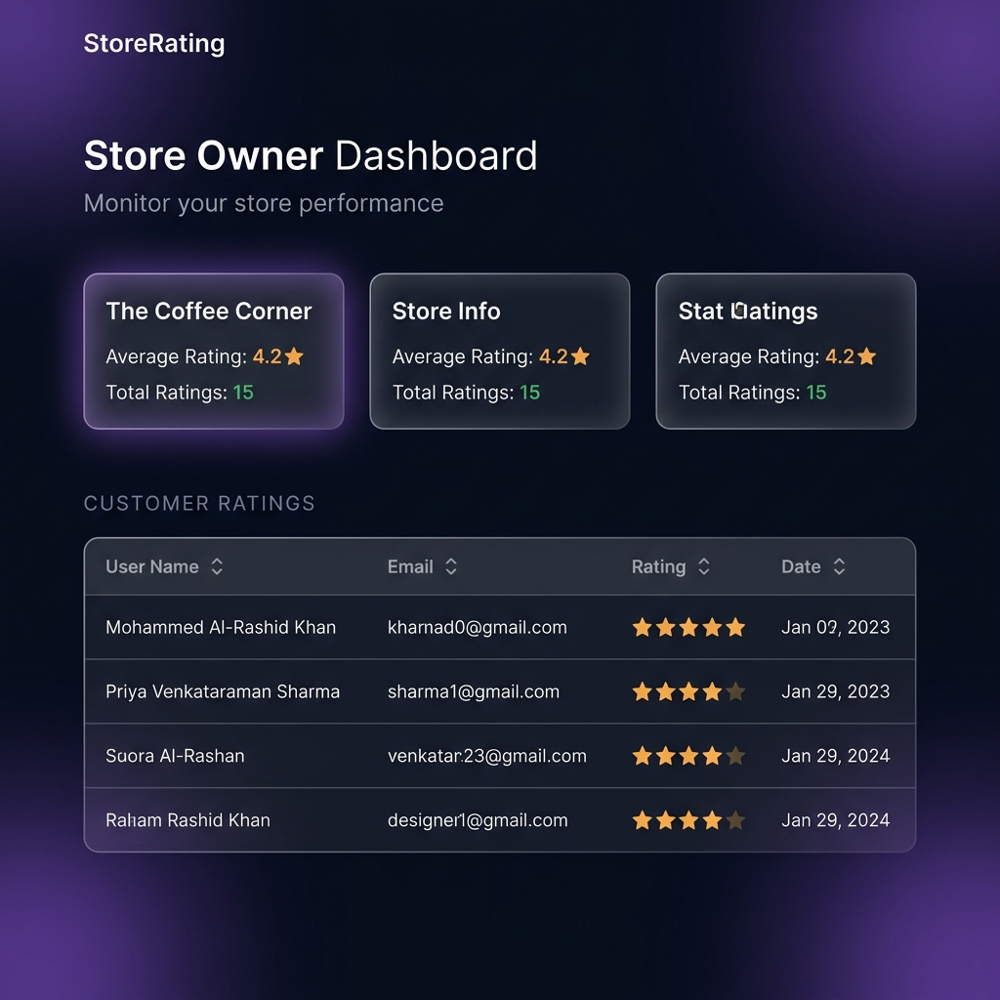

# 🌟 StoreRating Platform

> A full-stack web application that allows users to discover and rate stores. Built as part of the **FullStack Intern Coding Challenge**.

[](https://react.dev/)
[](https://www.typescriptlang.org/)
[](https://expressjs.com/)
[](https://www.prisma.io/)
[](https://www.sqlite.org/)
[](https://vitejs.dev/)

---

## 📸 Screenshots

### 🔐 Login & Registration


### 🛡️ Admin Dashboard


### 🛒 User Store Directory


### 🏪 Store Owner Dashboard


---

## ✨ Features

### 👤 User Roles & Permissions

| Feature | System Admin | Normal User | Store Owner |
|---------|:---:|:---:|:---:|
| View dashboard stats | ✅ | ❌ | ❌ |
| Add users & stores | ✅ | ❌ | ❌ |
| View all users list | ✅ | ❌ | ❌ |
| View all stores list | ✅ | ✅ | ❌ |
| Submit/modify ratings | ❌ | ✅ | ❌ |
| View own store ratings | ❌ | ❌ | ✅ |
| Update password | ✅ | ✅ | ✅ |
| Sign up via register page | ❌ | ✅ | ❌ |

### 🛡️ System Administrator
- Dashboard with **Total Users**, **Total Stores**, **Total Ratings** counters
- Add new **users** (Name, Email, Password, Address, Role)
- Add new **stores** (Name, Email, Address, Owner)
- View & filter users by **Name, Email, Address, Role**
- View stores with **average ratings**
- **Sortable** tables (ascending/descending) on all columns

### 👤 Normal User
- **Register** and **login** to the platform
- Browse all stores with **search** (Name & Address)
- View **store ratings** and **submit ratings** (1–5 stars)
- **Modify** previously submitted ratings
- Update account **password**

### 🏪 Store Owner
- View **all customer ratings** for their store(s)
- See **average rating** per store
- Sortable customer ratings table
- Update **password**

---

## 🏗️ Tech Stack

### Backend
| Technology | Purpose |
|---|---|
| **Express.js v5** | REST API framework |
| **TypeScript** | Type-safe backend code |
| **Prisma ORM** | Database abstraction layer |
| **SQLite** | Embedded database (dev-ready, no setup needed) |
| **bcryptjs** | Password hashing |
| **jsonwebtoken** | JWT authentication |
| **Zod** | Request validation schemas |

### Frontend
| Technology | Purpose |
|---|---|
| **React 19** | UI framework |
| **TypeScript** | Type-safe components |
| **Vite** | Fast build tool & dev server |
| **React Router v7** | Client-side routing |
| **Axios** | HTTP client with auth interceptor |
| **Lucide React** | Icon library |
| **Vanilla CSS** | Custom glassmorphism design system |

---

## 📐 Database Schema

```
User
├── id         (UUID, PK)
├── name       (String, min 20 / max 60)
├── email      (String, unique)
├── password   (String, hashed)
├── address    (String, max 400)
├── role       (SYSTEM_ADMIN | NORMAL_USER | STORE_OWNER)
├── stores     → Store[]
└── ratings    → Rating[]

Store
├── id         (UUID, PK)
├── name       (String)
├── email      (String)
├── address    (String)
├── ownerId    → User.id
└── ratings    → Rating[]

Rating
├── id         (UUID, PK)
├── rating     (Int, 1–5)
├── userId     → User.id
├── storeId    → Store.id
└── @@unique([userId, storeId])   ← one rating per user per store
```

---

## 🚀 Getting Started

### Prerequisites
- **Node.js** v18+ (download: https://nodejs.org)
- **npm** v9+
- **Git**

---

### 1️⃣ Clone the Repository

```bash
git clone https://github.com/AbdulRazak5764/FullStack-Intern-Coding-Challenge.git
cd FullStack-Intern-Coding-Challenge
```

---

### 2️⃣ Setup Backend

```bash
cd backend

# Install dependencies
npm install

# Setup the database (generates Prisma client & pushes schema to SQLite)
npx prisma generate
npx prisma db push

# Seed the admin user
node seed.js

# Start the development server
npm run dev
```

> ✅ Backend runs on **http://localhost:5000**

---

### 3️⃣ Setup Frontend

Open a **new terminal**:

```bash
cd frontend

# Install dependencies
npm install

# Start Vite dev server
npm run dev
```

> ✅ Frontend runs on **http://localhost:5173**

---

### 4️⃣ Login

Open **http://localhost:5173** in your browser.

| Role | Email | Password |
|------|-------|----------|
| **System Admin** | `admin@store.com` | `Admin@123!` |
| Normal User | Register via `/register` | Your choice |

---

## 📁 Project Structure

```
FullStack-Intern-Coding-Challenge/
│
├── backend/                    # Express + Prisma API
│   ├── src/
│   │   ├── index.ts            # App entry point, CORS, routes setup
│   │   ├── prisma.ts           # Prisma client singleton
│   │   ├── middlewares/
│   │   │   └── auth.ts         # JWT authenticate & authorize middleware
│   │   ├── routes/
│   │   │   ├── auth.ts         # /api/auth — login, register, update password
│   │   │   ├── users.ts        # /api/users — admin CRUD
│   │   │   ├── stores.ts       # /api/stores — list + admin create
│   │   │   ├── ratings.ts      # /api/ratings — submit/modify ratings
│   │   │   └── dashboard.ts    # /api/dashboard — admin & owner stats
│   │   └── validators/
│   │       └── index.ts        # Zod schemas for all inputs
│   ├── prisma/
│   │   └── schema.prisma       # Database models
│   ├── seed.js                 # Admin user seeder
│   ├── nodemon.json            # Nodemon + ts-node config
│   └── package.json
│
├── frontend/                   # React + Vite SPA
│   ├── src/
│   │   ├── main.tsx            # App bootstrap
│   │   ├── App.tsx             # Routing + protected routes
│   │   ├── index.css           # Full design system (glassmorphism)
│   │   ├── context/
│   │   │   └── AuthContext.tsx # Auth state, JWT storage, axios base
│   │   ├── components/
│   │   │   └── Navbar.tsx      # Sticky navbar with role-aware links
│   │   └── pages/
│   │       ├── Login.tsx       # Login form
│   │       ├── Register.tsx    # Registration form (normal users)
│   │       ├── AdminDashboard.tsx  # Admin: stats, users, stores tabs
│   │       ├── UserDashboard.tsx   # User: store cards + star ratings
│   │       ├── OwnerDashboard.tsx  # Owner: store stats + raters table
│   │       └── Profile.tsx         # Change password page
│   └── package.json
│
├── docs/
│   └── screenshots/            # Dashboard screenshots for README
├── docker-compose.yml          # PostgreSQL container (optional)
└── README.md
```

---

## 🔌 API Reference

### Auth
| Method | Endpoint | Auth | Description |
|--------|----------|------|-------------|
| `POST` | `/api/auth/login` | ❌ | Login any user |
| `POST` | `/api/auth/register` | ❌ | Register normal user |
| `PUT` | `/api/auth/password` | ✅ | Update own password |

### Users (Admin only)
| Method | Endpoint | Description |
|--------|----------|-------------|
| `GET` | `/api/users?search=&role=&sortBy=&sortOrder=` | List users with filters |
| `POST` | `/api/users` | Create new user |
| `GET` | `/api/users/:id` | Get user details |

### Stores
| Method | Endpoint | Auth | Description |
|--------|----------|------|-------------|
| `GET` | `/api/stores?search=&sortBy=&sortOrder=` | ✅ All roles | List stores |
| `POST` | `/api/stores` | Admin | Create store |

### Ratings
| Method | Endpoint | Auth | Description |
|--------|----------|------|-------------|
| `POST` | `/api/ratings` | Normal User | Submit/modify rating |

### Dashboard
| Method | Endpoint | Auth | Description |
|--------|----------|------|-------------|
| `GET` | `/api/dashboard/admin` | Admin | Platform-wide stats |
| `GET` | `/api/dashboard/owner` | Store Owner | Own store stats |

---

## ✅ Form Validations

| Field | Rules |
|-------|-------|
| **Name** | Min 20 characters, Max 60 characters |
| **Email** | Valid email format |
| **Password** | 8–16 chars, ≥1 uppercase, ≥1 special character |
| **Address** | Max 400 characters |
| **Rating** | Integer between 1 and 5 |

---

## 🔐 Security

- Passwords hashed with **bcryptjs** (10 salt rounds)
- Authentication via **JWT** (expires in 24h)
- Route protection with **middleware** (authenticate + authorize)
- Input validation on both **frontend** and **backend** (Zod)
- CORS configured for allowed origins only

---

## 🎨 Design System

- **Dark glassmorphism** UI with `backdrop-filter: blur`
- **Inter** font from Google Fonts
- Custom CSS variables for consistent theming
- Responsive layout (mobile-friendly)
- Smooth micro-animations on hover/focus
- Role-colored badges: 🔴 Admin · 🔵 User · 🟡 Store Owner

---

## 👨‍💻 Author

**Abdul Razak Shaik**  
GitHub: [@AbdulRazak5764](https://github.com/AbdulRazak5764)

---

## 📄 License

This project was created for the **FullStack Intern Coding Challenge**.
